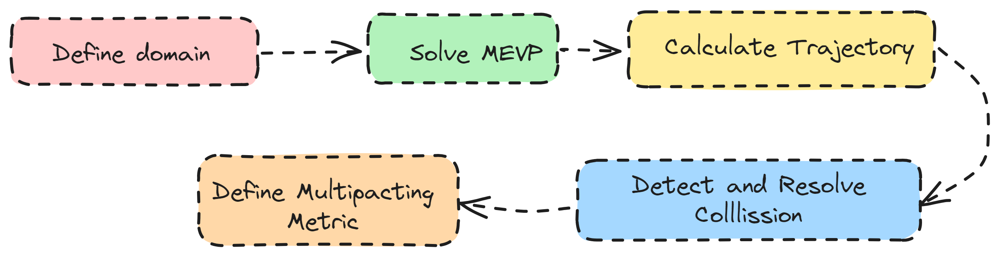

# PyMultipact

Multipacting is a phenomenon arising from the emission and subsequent multiplication of charged 
particles in accelerating radiofrequency (RF) cavities, which can limit the achievable RF power. 
Predicting field levels at which multipacting occurs is crucial for optimising cavity geometries. 
This paper presents an open-source Python code (PyMultipact) for analysing multipacting 
in 2D axisymmetric cavity structures. The code leverages the NGSolve framework to solve the 
Maxwell eigenvalue problem (MEVP) for the electromagnetic (EM) fields in axisymmetric RF structures.
The relativistic Lorentz force equation governing the motion of charged particles is then integrated 
using the calculated fields within the domain to describe the motion of charged particles. 
Benchmarking against existing multipacting analysis tools is performed to validate the code's accuracy.

# Workflow

<p align="center">
  
</p>

The workflow begins by defining the domain using `geometry_writer.py`. 
Next, the Maxwell eigenvalue problem (MEVP) is solved with the NGSolve finite element method (FEM) 
framework via `domain.compute_field`. Collision detection and handling are performed in Python. 
The multipacting metrics currently defined are the counter and enhanced counter functions. 
To analyse the domain for multipacting, `domain.analyse_multipacting` is used.


# Example - TESLA Cavity Geometry (Jupyter)

To get started, import the ``Project`` and ``Domain`` classes from ``domain``. A ``Project`` object is used to define the project folder
and required to initialise a ``Domain`` object. A ``Domain`` object contains every object that can be found in
the domain. For example, a ``Particles`` object can be added to the ``Domain`` object. Certain physics
can also be defined in a ``Domain`` object. For example, the eigenmodes of the domain can be computed
by calling the ``<domain_object>.compute_field()``. A ``Domain`` object also contains the necessary methods for
making plots and post-processing.

```python
from pymultipact.domain import Project, Domain

# create project
proj = Project()
proj.create_project('<project_folder>/TESLA')

# define domain
domain = Domain(proj)
```

The defined domain contains, by default, the TESLA cavity geometry (mid-cell) [[1]](#1). One possible parameterisation of the 
mid-cell of an elliptical cavity geometry is given in the figure below.


The default elliptical cavity geometry installed with PyMultipact is the TESLA cavity mid-cell geometry. The following 
line of code can be used to define a new elliptical geometry boundary,

```python

import numpy as np
# format: cell = [A, B, a, b, Ri, L, Req] in meters.
mid_cell = np.array([42, 42, 12, 19, 35, 57.7, 103.3])*1e-3
domain.define_elliptical_cavity(mid_cell=mid_cell)
```

The geometry can be visualised using

```python

domain.draw()
```

A ``Domain`` object is meshed automatically with a default size if no specification
for the mesh is given after definition. The mesh can be regenerated for a specific mesh resolution and visualised
using

```python
domain.mesh_domain(<maxh>)
domain.draw_mesh()
```

Next, compute and visualise the fields using

```python
domain.compute_fields()
domain.draw_fields(mode=1, which='E')
```

where the ``which`` keyword is used to specify if the electric (E) or magnetic (H) field should be plotted.
The ``mode`` keyword specifies for which mode the field should be plotted. Mode indexing starts from 1.
Multipacting analysis is then carried out using

```python
domain.analyse_multipacting()
```

The currently implemented multipacting metrics are the counter and enhanced counter functions. 
Results from multipacting can be plotted with the following lines of code.

```python
domain.plot_cf()  # to plot counter function
domain.plot_Ef()  # to plot final impact energy
domain.plot_ef()  # to plot enhanced counter function
```

The results can be compared with the result obtained in  [[2]](#2).

## References
<a id="1">[1]</a> 
Aune, Bernard, et al.
"Superconducting TESLA cavities." Physical Review special topics-accelerators and beams 3.9 (2000): 092001.

<a id="2">[2]</a> 
Zhu, Feng, et al. 
"High field multipacting of 1.3 GHZ Tesla cavity." This Workshop, TuP51. 2003.