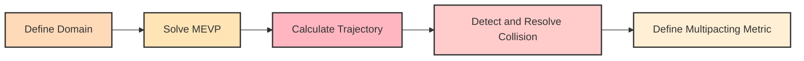
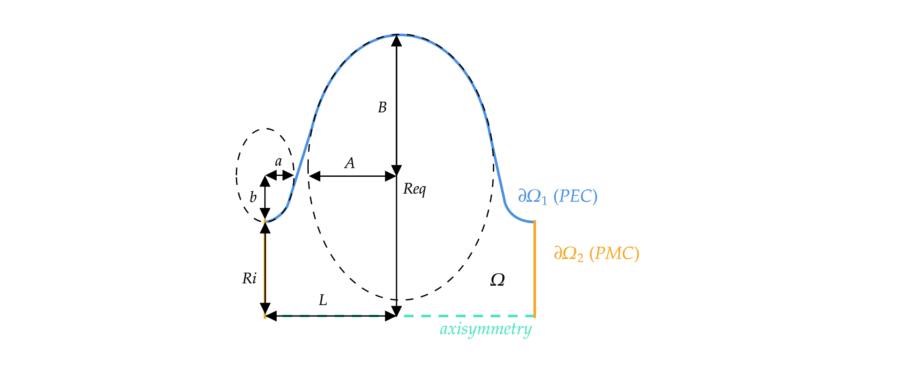

# PyMultipact

Multipacting is a phenomenon arising from the emission and subsequent multiplication of charged 
particles in accelerating radiofrequency (RF) cavities, which can limit the achievable RF power. 
Predicting field levels at which multipacting occurs is crucial for optimising cavity geometries. 
This paper presents an open-source Python code (PyMultipact) for analysing multipacting 
in 2D axisymmetric cavity structures. The code leverages the NGSolve framework to solve the 
Maxwell eigenvalue problem (MEVP) for the electromagnetic (EM) fields in axisymmetric RF structures.
The relativistic Lorentz force equation governing the motion of charged particles is then integrated 
using the calculated fields within the domain to describe the motion of charged particles. 
Benchmarking against existing multipacting analysis tools is performed to validate the code's accuracy.

# Workflow



The workflow begins by defining the domain using `geometry_writer.py`. 
Next, the Maxwell eigenvalue problem (MEVP) is solved with the NGSolve finite element method (FEM) 
framework via `domain.compute_field`. Collision detection and handling are performed in Python. 
The multipacting metrics currently defined are the counter and enhanced counter functions. 
To analyse the domain for multipacting, `domain.analyse_multipacting` is used.


# Example -TESLA Cavity Geometry (Jupyter)
The parameterisation of the TESLA cavity geometry is given in the figure below.



To get started, import the ``Domain`` class. A ``Domain`` object contains every object that can be found in
the domain. For example, a ``Particles`` object can be added to the ``Domain`` object. Certain physics
can also be defined in a ``Domain`` object. For example, the eigenmodes of the domain can be computed
by calling the ``<domain_object>.compute_field()``. A ``Domain`` object also contains the necessary methods for
making plots and post-processing. 

```
from domain import Domain
domain = Domain()
```

When a ``Domain`` object is defined, it is meshed automatically with a default size if no specification
for the mesh is given. The mesh can be regenerated for a specific mesh resolution using

```domain.mesh_domain(<maxh>)```. 

The mesh can then be viewed using

```domain.draw_mesh()```

Next, compute and visualise the fields using

```
domain.compute_fields()
domain.draw_fields(mode=1, which='E')
```

where the ``which`` keyword is used to specifty if the electric (E) or magnetic (H) field should be plotted.
The ``mode`` keyword specifies for which mode the field should be plotted. Mode indexing starts from 1.
Multipacting analysis is then carried out using

```
domain.analyse_multipacting()
```
