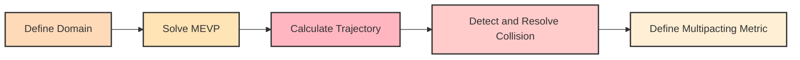

# PyMultipact

Multipacting is a phenomenon arising from the emission and subsequent multiplication of charged 
particles in accelerating radiofrequency (RF) cavities, which can limit the achievable RF power. 
Predicting field levels at which multipacting occurs is crucial for optimising cavity geometries. 
This paper presents an open-source Python code (PyMultipact) for analysing multipacting 
in 2D axisymmetric cavity structures. The code leverages the NGSolve framework to solve the 
Maxwell eigenvalue problem (MEVP) for the electromagnetic (EM) fields in axisymmetric RF structures.
The relativistic Lorentz force equation governing the motion of charged particles is then integrated 
using the calculated fields within the domain to describe the motion of charged particles. 
Benchmarking against existing multipacting analysis tools is performed to validate the code's accuracy.

# Workflow

<html>

  
  

    
   <strong>Define Domain</strong>

  

  

    <strong>Solve MEVP</strong>
  

  

    <strong>Calculate Trajectory</strong>
  

  

    <strong>Detect and Resolve Collision</strong>
  

  

    <strong>Define Multipacting Metric</strong>
  

</html>

